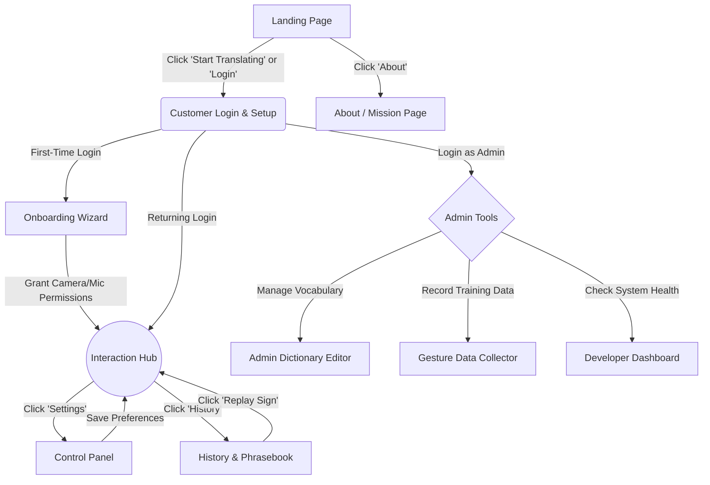

# SignBridge — Page Connectivity & User Flow

This document maps out how every page in the application connects to one another, line-by-line. Use this as your routing architecture when you start coding.

## 1. Visual Flow Map (Mermaid Diagram)

---

## 2. Line-by-Line Routing Structure

Here is the exact step-by-step connectivity path from the perspective of the application router.

### Part A: Public / Unauthenticated Users
1. **Entry Point:** User visits the root URL (`/`).
2. **Landing Page:** They see the `Landing Page`. 
   - *Option 1:* Click "About". Routes to the `About / Mission` page.
   - *Option 2:* Click "Start Translating". Routes to the `Authentication` page.

### Part B: Authentication & Setup Flow
3. **Login & Setup Page:** User arrives at `/auth`.
   - They enter their email/password and select their Role (Deaf/Hearing) and Dialect (e.g., ISL).
   - The system checks: *Is this their first time logging in?*
   - *If YES:* Routes to `Onboarding Wizard`.
   - *If NO:* Routes directly to the `Interaction Hub`.

4. **Onboarding Wizard (First-timers only):** User arrives at `/onboarding`.
   - The wizard asks for Camera and Microphone browser permissions.
   - Once permissions are granted, user clicks "Continue".
   - Routes to the `Interaction Hub`.

### Part C: The Core App (Authenticated Users)
5. **Interaction Hub:** User arrives at `/hub`. This is the main translator page.
   - *Connectivity from here:*
     - **Voice/Camera Input:** No page reload. Data is processed right on the page, and the `3D Avatar` moves or the text translates.
     - **Click "Settings/Config":** Routes to the `Control Panel` page.
     - **Click "View History":** Routes to the `History & Phrasebook` page.

6. **Control Panel:** User arrives at `/settings`.
   - They change an avatar color or swap a dialect.
   - **Click "Save Settings":** Routes back to the `Interaction Hub` with the new settings applied.

7. **History & Phrasebook:** User arrives at `/history`.
   - They see their past conversations stored in local storage.
   - **Click "Replay":** Routes back to the `Interaction Hub` and automatically triggers the avatar to sign the saved phrase.

### Part D: The Admin/Dev Layer
*(If the user logs in at Step 3 and their account role is flagged as `ADMIN` in your database, they unlock these hidden paths)*

8. **Admin Dictionary Editor:** Admin arrives at `/admin/dictionary`.
   - They map new words to new animations.
   - **Click "Needs Gesture Data":** Routes to the `Gesture Data Collector`.

9. **Gesture Data Collector:** Admin arrives at `/admin/collector`.
   - Admin records their own webcam movement to generate MediaPipe landmark coordinates.
   - **Click "Save to Dataset":** Saves the JSON file locally.

10. **Developer Dashboard:** Admin arrives at `/admin/dashboard`.
    - They review performance metrics (FPS, Latency) and system health.
